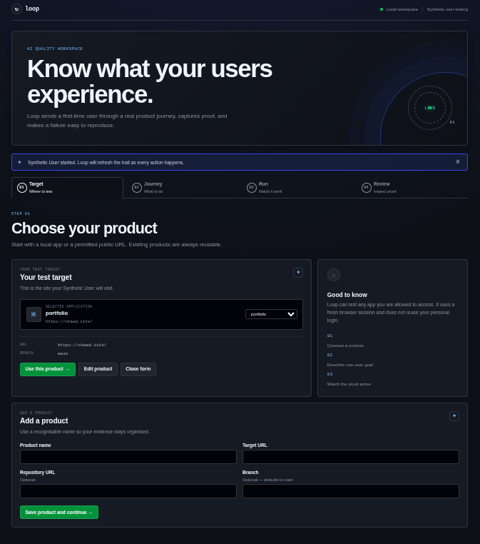
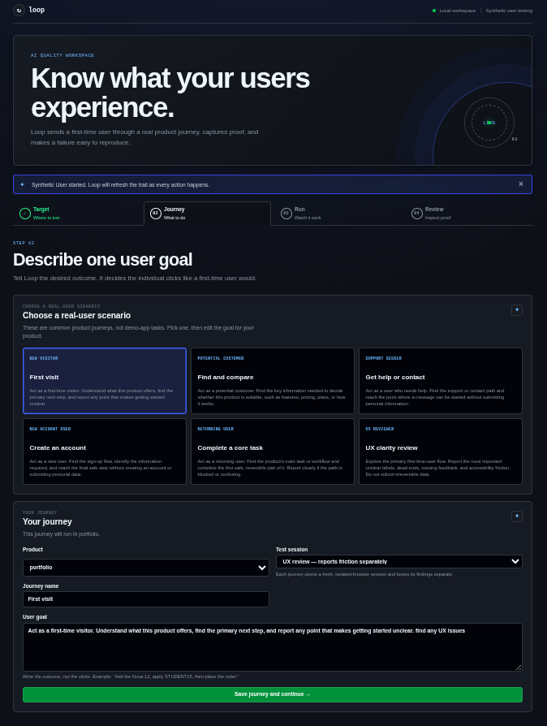
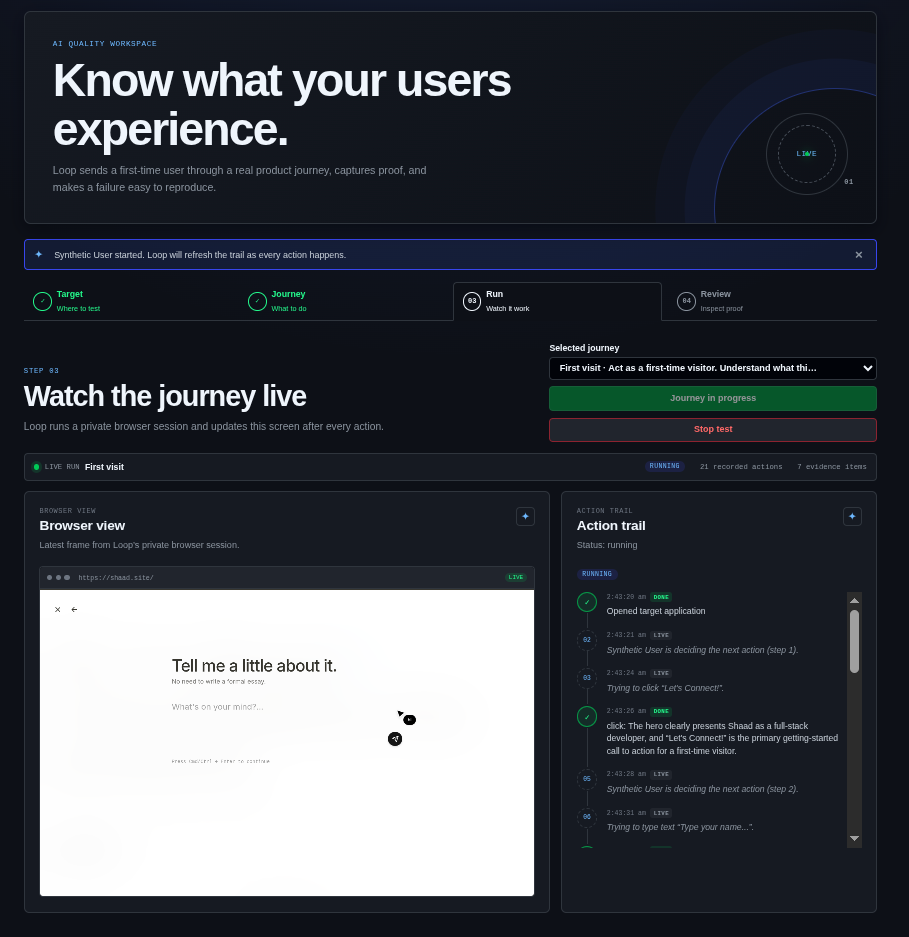
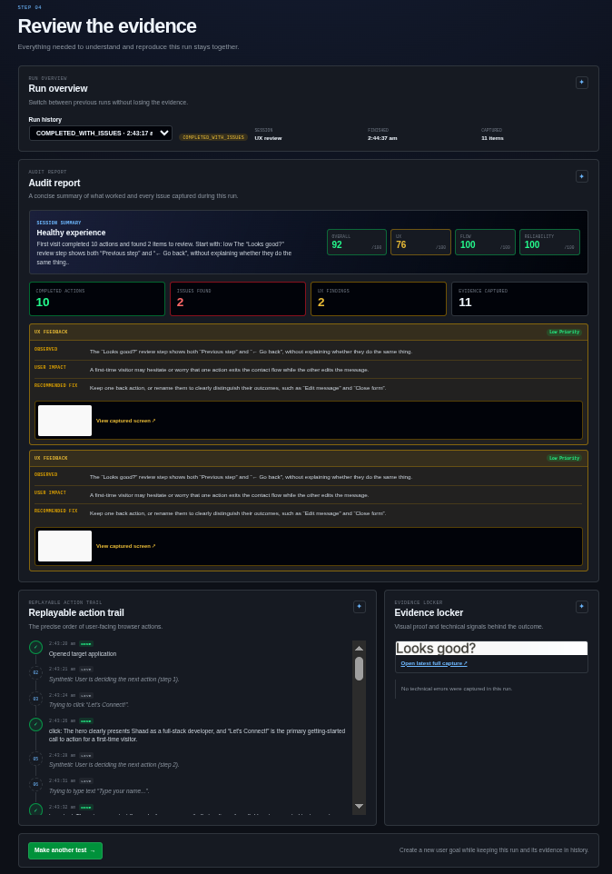

# Loop

## Overview

Loop is an AI-assisted web journey testing tool. A team adds a product URL, chooses a realistic user scenario, and Loop uses a Synthetic User to navigate the visible interface in an isolated Chromium session. It captures actions and screenshots, identifies user-facing UX or functional friction, and turns the session into a clear final report.

## Problem Statement

Traditional testing often verifies individual features but misses the real user journey: unclear calls to action, blocking popups, confusing forms, inaccessible feedback, and dead ends that stop a first-time visitor from reaching their goal. Manually testing every flow is slow and difficult to reproduce.

## Solution

Loop acts like a first-time user, follows a focused goal, and records evidence as it goes. It automatically clears safe blocking popups, preserves protected steps such as login and OTP for a human handoff, and creates a report that explains issues in simple language. Each test session keeps its own action trail, screenshots, findings, and scores so teams can understand, reproduce, and fix problems.

## Features

- Test any product URL that you own or are allowed to audit.
- Start from real-user scenarios such as first visit, comparing information, getting support, or creating an account.
- Run a goal-driven Synthetic User in a private Playwright Chromium session.
- Automatically dismiss safe blocking popups such as welcome prompts, newsletter banners, and rejectable cookie banners.
- Keep sign-in, OTP, CAPTCHA, payment, and consent steps safe with a browser-only user handoff.
- Watch live browser screenshots and an action trail while a test runs.
- Capture focused screenshots for UX feedback instead of long full-page images.
- Stop an active run and review all evidence collected so far.
- Generate a final report with a simple session summary, user-focused findings, and Overall, UX, Flow, and Reliability scores.
- Hide developer-only console noise so reports focus on normal user impact.

## Tech Stack

**Frontend:** Next.js, React, TypeScript

**Backend:** FastAPI, Python, Pydantic, SQLAlchemy

**Database:** SQLite

**APIs / Services:** OpenAI Responses API, FastAPI REST API

**Hosting / Deployment:** Local development environment; deployment link can be added for the demo

**Other Tools:** Playwright, Chromium, Git, npm, pytest

## Codex / OpenAI Usage

Codex and OpenAI were used throughout the hackathon to accelerate the build while keeping the final product focused on real users.

- **Ideation and architecture planning:** Defined the Synthetic User workflow, data model, evidence lifecycle, and safe user handoff design.
- **Code generation:** Helped build the FastAPI services, Next.js dashboard, agent workflow, Playwright browser layer, and API integration.
- **Debugging and testing:** Investigated browser navigation failures, popup blockers, ambiguous controls, repeated actions, screenshots, structured model output, and data persistence.
- **UI/UX development:** Iterated on the dark GitHub-inspired dashboard, live action timeline, final report, clear feedback cards, and user-friendly intervention states.
- **Documentation:** Helped create setup instructions, project architecture notes, and this README.
- **OpenAI API integration:** The Synthetic User uses the OpenAI Responses API to reason about the visible page, choose one safe next action, and produce structured UX feedback.

## Demo

### Live Demo

<!-- Add the deployed project link here. -->

### Demo / Pitch Video

[](https://drive.google.com/file/d/1JI1vLzGM4uTB6bgEBrM_22JhReq07M6X/view?usp=sharing)

[▶ Watch the Loop demo / pitch video](https://drive.google.com/file/d/1JI1vLzGM4uTB6bgEBrM_22JhReq07M6X/view?usp=sharing)

## Screenshots

### 1. Choose a product



### 2. Choose a real-user scenario



### 3. Watch the journey live



### 4. Review evidence and scores



## How to Run Locally

Clone the repository:

```bash
git clone <repo-url>
cd loop
```

Start the backend:

```bash
cd backend
python3 -m venv .venv
source .venv/bin/activate
pip install -r requirements.txt
playwright install chromium
cp .env.example .env
```

Add a new `OPENAI_API_KEY` to `backend/.env`. Never commit this file or place a key in `.env.example`.

Then run the API:

```bash
uvicorn app.main:app --reload --port 8000
```

In a second terminal, start the frontend:

```bash
cd frontend
npm install
npm run dev
```

Open `http://localhost:3000`. The API documentation is available at `http://localhost:8000/docs`.

## Additional Notes

- Loop is designed for products and websites you own or have permission to test.
- It stays on the configured product origin and uses visible controls only.
- It does not store or send passwords, OTPs, payment details, or CAPTCHA responses to the AI model.
- Public websites can block automation, require consent, or change their UI. Those cases may require a browser handoff or create a limitation for the run.
- The current scoring system is session-specific and directional. It helps prioritize evidence found during one journey; it is not a complete accessibility certification.
- Future work includes team workspaces, richer report export, configurable personas, authenticated test profiles, and deployed browser workers.
